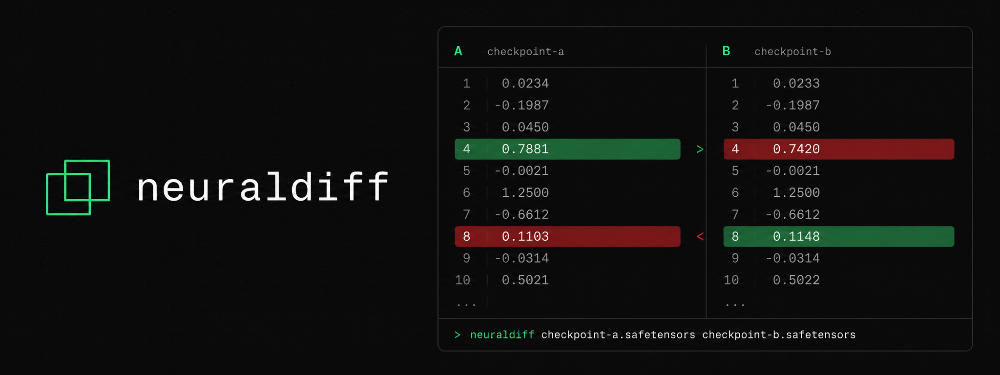
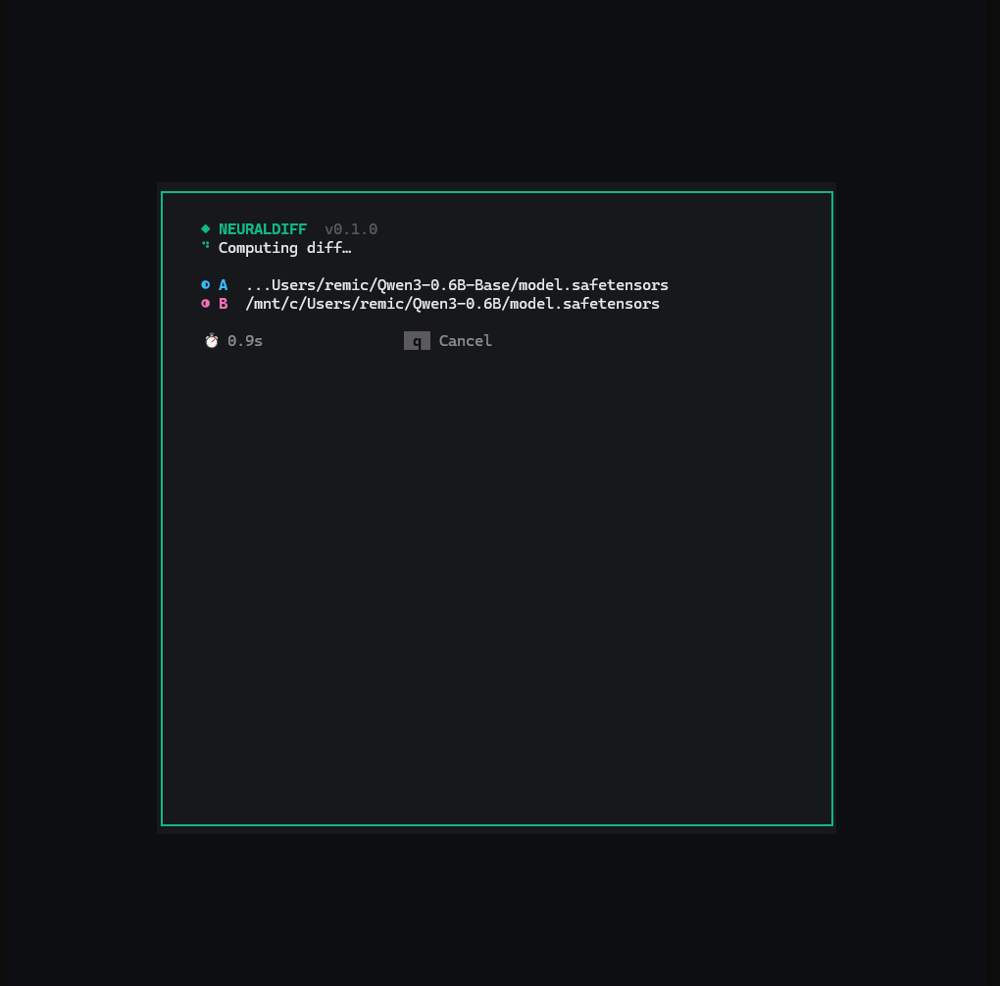
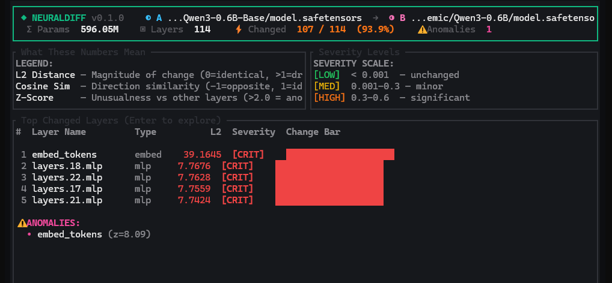
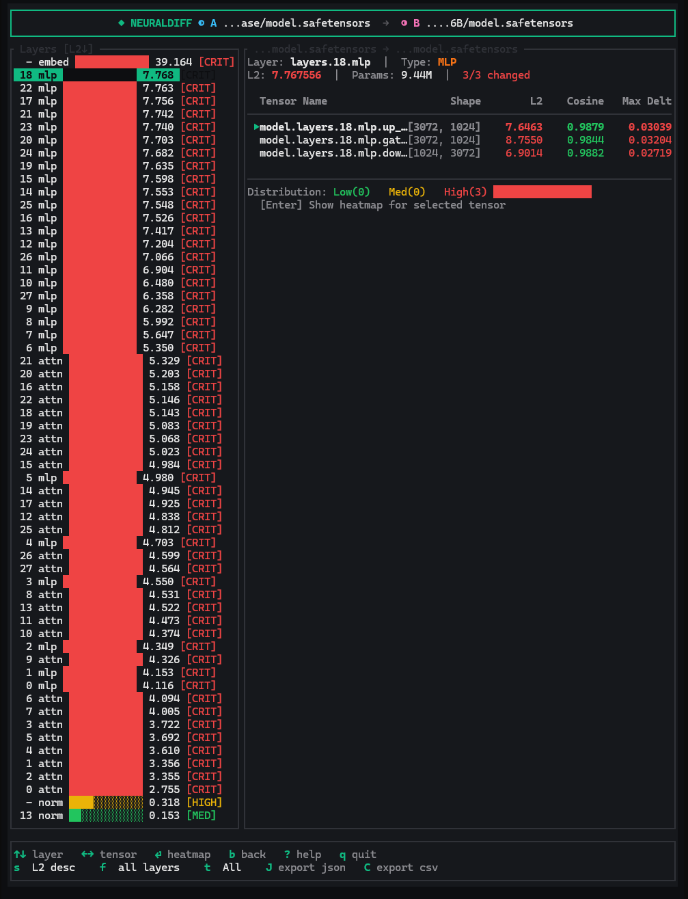
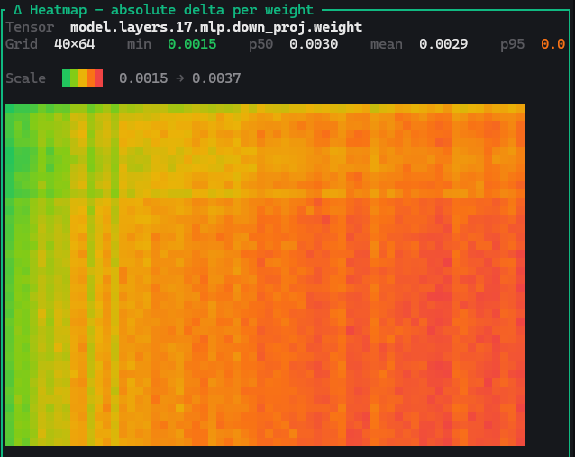
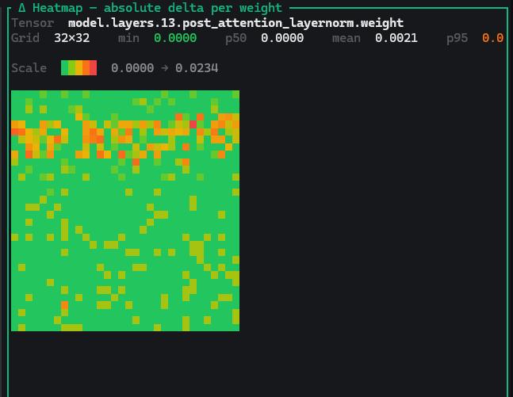
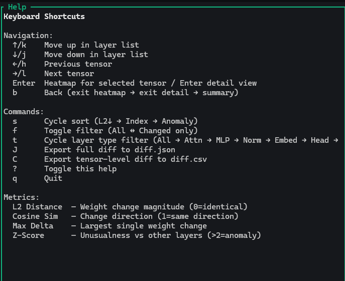
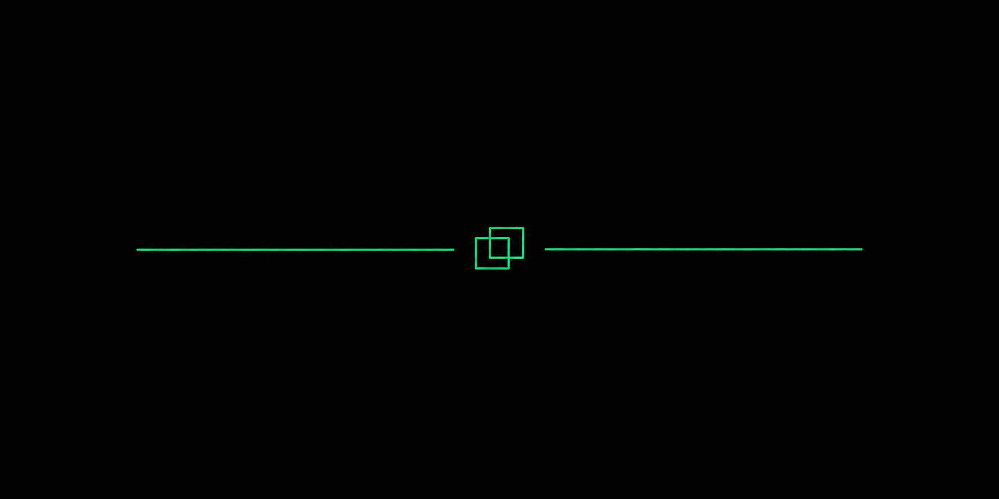

<div align="center">



# neuraldiff

**Visual diff for AI model checkpoints. See exactly what your fine-tune changed.**

[](LICENSE)
[](https://www.rust-lang.org/)
[]()

</div>

---

## What it does

`neuraldiff` compares two `.safetensors` model checkpoints and shows what changed — at the layer, tensor, and individual-weight level. Run one command, pick two models from a scan of your filesystem, get an interactive terminal UI with:

- **Per-layer L2 distance, cosine similarity, max delta** — weighted by parameter count
- **Anomaly detection** with z-scores so unusually-shifted layers stand out
- **Per-tensor heatmap** rendered as a smooth half-block gradient (red → yellow → green) directly in your terminal
- **JSON / CSV export** for scripting and CI pipelines

Useful for: inspecting fine-tunes vs. base models, comparing LoRA merges, debugging training divergence, sanity-checking quantization, or simply understanding what a checkpoint actually changed.

---

## Quick start

```bash
# Build
git clone https://github.com/Zertannax/neuraldiff
cd neuraldiff
cargo build --release

# Launch — that's it
./target/release/neuraldiff
```

A scan of your filesystem starts immediately. Pick model A, pick model B, hit `Enter`, watch the diff render.

If you already know the paths:

```bash
neuraldiff diff base.safetensors finetuned.safetensors
```

---

## Demo — Qwen3-0.6B Base vs Instruct

Comparing the base model with its instruct fine-tune. **596M parameters, 114 layers, diff in ~8 seconds** on a regular laptop CPU.

### 1. Loading screen



### 2. Summary view — headline numbers at a glance

The summary tells you immediately that 93.9% of layers changed and that `embed_tokens` is the biggest anomaly (z-score 8.09) — the instruct fine-tune massively reshaped the embeddings.



### 3. Detail view — drill into a layer



### 4. Heatmap — see which weights changed

A smooth red-yellow-green gradient over the actual delta values. Half-block rendering doubles the vertical resolution within the terminal.



Layernorm tensors often show interesting structured patterns:



### 5. Help



---

## CLI reference

```bash
neuraldiff                              # unified TUI: scan → pick → diff
neuraldiff diff <A> <B>                 # diff two models in TUI
neuraldiff diff <A> <B> --json          # JSON to stdout
neuraldiff diff <A> <B> --output diff.csv   # write to file (.json or .csv)

neuraldiff summary <A> <B>              # one-screen text summary, no TUI
neuraldiff summary <A> <B> -n 20        # show top 20 changed layers

neuraldiff inspect <model>              # list all tensors of a single model
neuraldiff inspect <model> --top 20     # top 20 tensors by parameter count
neuraldiff inspect <model> --json       # machine-readable

neuraldiff scan                         # find .safetensors models on disk
neuraldiff scan --root /path/to/dir     # scan a specific directory
neuraldiff scan --json                  # machine-readable
```

Aliases: `d` = `diff`, `i` = `inspect`, `s` = `scan`.

### Keyboard shortcuts (TUI)

| Key | Action |
|-----|--------|
| `↑↓` `j/k` | Navigate the layer list |
| `←→` `h/l` | Previous / next tensor |
| `Enter` | Enter detail view → show heatmap for selected tensor |
| `b` | Back (heatmap → detail → summary) |
| `s` | Cycle sort (L2↓ → Index → Anomaly) |
| `f` | Toggle filter (All ↔ Changed only) |
| `t` | Cycle layer-type filter (All → Attn → MLP → Norm → Embed → Head → Other) |
| `J` | Export full diff to `diff.json` |
| `C` | Export tensor-level diff to `diff.csv` |
| `?` | Show / hide help |
| `q` | Quit |

---

## Supported architectures

Layer grouping is done via per-architecture regex patterns. Currently:

| Architecture | Naming pattern |
|--------------|----------------|
| **LLaMA / Qwen / Mistral** | `model.layers.N.{self_attn,mlp,input_layernorm,post_attention_layernorm}` |
| **GPT-2** | `transformer.h.N.{attn,mlp,ln_1,ln_2}` |
| **Falcon** | `transformer.h.N.{self_attention,mlp,ln_attn,ln_mlp,input_layernorm}` |

Tensors that don't match any of these fall into a generic `Other` bucket grouped by path prefix.

### Supported dtypes

`F32` · `F16` · `BF16` · `I64` / `I32` / `I16` / `I8` · `U8` · `Bool`. All decoded to `f32` internally for diff math.

---

## Performance

| Model size | Load time | Diff time |
|-----------|-----------|-----------|
| 600M (BF16) | ~1s | ~7s |
| 3B | ~8s | ~12s |
| 7B | ~20s | ~30s |
| 13B | ~40s | ~60s |

Reference numbers on consumer hardware. Uses `memmap2` for zero-copy I/O and `rayon` for parallel tensor diffing.

---

## How it works

```
CLI args → SafetensorsLoader → DiffEngine → LayerMapper → TUI
              (Arc<Mmap>)       (rayon)    (typed enum)   (ratatui)
```

- `loader.rs` — parses safetensors, memory-maps, exposes `load_tensor_data` by offset
- `diff.rs` — computes L2 / cosine / max-delta per tensor in parallel
- `mapper.rs` — typed `LayerComponent` enum groups tensors into logical layers
- `metrics.rs` — `l2_norm`, `cosine_similarity`
- `scanner.rs` — recursive `.safetensors` discovery (WSL-aware on Linux)
- `tui.rs` — interactive terminal UI with heatmap, summary, detail, help
- `terminal.rs` — RAII `TerminalGuard` so the terminal is always restored

---

## Development

```bash
cargo build                    # debug
cargo build --release          # release
cargo test --all-features      # 33 tests
cargo clippy --all-targets --all-features
cargo fmt --check
```

---

## Roadmap

See [TODO.md](TODO.md) for the full plan.

- **v0.2.0** (in progress) — multi-shard models (Llama 70B, Gemma 31B), NaN/Inf handling, CI, binary releases
- **v0.3.0** — per-dtype tests, F64 accumulators, scrolling layer lists, scoped anomaly detection
- **v1.0.0** — Web 3D viz, GGUF support, LoRA diff mode, streaming for >10GB models

---

## License

MIT — see [LICENSE](LICENSE).

<div align="center">
  <br>
  
</div>
